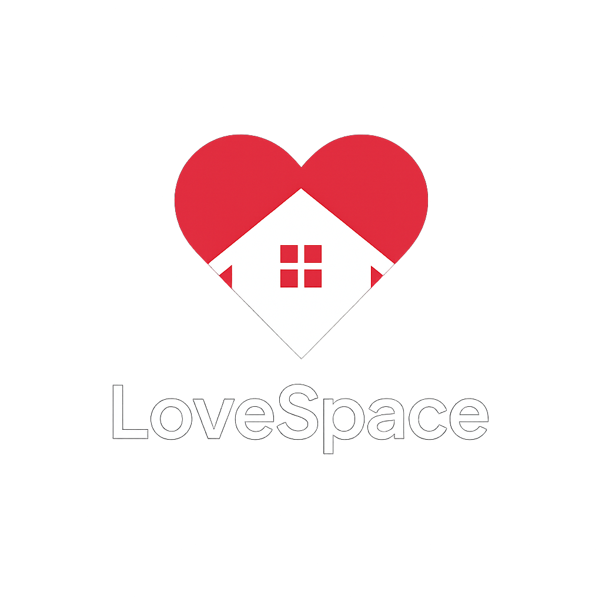

# LoveSpace 💖 - Ruang Digital untuk Pasangan LDR

<p align="center">
  
</p>

<p align="center">
  <strong>Tetap terhubung, berbagi momen, dan tumbuhkan cinta meski terpisah jarak.</strong>
</p>

<p align="center">
  <a href="https://github.com/danielnoveno/MySpaceLove/stargazers"></a>
  <a href="https://github.com/danielnoveno/MySpaceLove/network/members"></a>
  <a href="https://github.com/danielnoveno/MySpaceLove/issues"></a>
  <a href="https://github.com/danielnoveno/MySpaceLove/blob/main/LICENSE"></a>
</p>

---

**LoveSpace** adalah aplikasi web modern yang dirancang khusus untuk membantu pasangan yang menjalani hubungan jarak jauh (LDR) agar tetap merasa dekat. Dengan fitur-fitur interaktif dan personal, LoveSpace menjadi rumah digital bagi setiap pasangan untuk berbagi cerita, merencanakan masa depan, dan merayakan cinta setiap hari.

## ✨ Fitur Unggulan

| Fitur                 | Deskripsi                                                              | Ikon        |
| --------------------- | ---------------------------------------------------------------------- | ----------- |
| **Shared Space**      | Ruang privat untuk Anda dan pasangan dengan tema yang bisa disesuaikan. | 🏡          |
| **Love Timeline**     | Abadikan setiap momen berharga dalam sebuah timeline interaktif.       | 🗓️          |
| **Countdown**         | Hitung mundur hari-hari spesial, seperti hari jadi atau pertemuan.     | ⏳          |
| **Daily Messages**    | Dapatkan pesan cinta harian yang di-generate oleh AI (Google Gemini).  | 💌          |
| **Location Sharing**  | Bagikan lokasi real-time agar selalu merasa dekat.                     | 📍          |
| **Spotify Companion** | Dengarkan musik bersama, kirim lagu kejutan, dan buat playlist cinta.  | 🎵          |
| **Video Call**        | Lakukan panggilan video dan "nobar" (nonton bareng) langsung di aplikasi.| 📹          |
| **Love Journal**      | Tulis dan bagikan perasaan Anda dalam jurnal bersama.                  | 📔          |
| **Wishlist**          | Buat daftar keinginan bersama untuk masa depan.                        | 🎁          |
| **Media Gallery**     | Simpan semua foto dan video kenangan dalam satu galeri.                | 🖼️          |
| **Surprise Notes**    | Kirim catatan kejutan untuk mencerahkan hari pasangan.                 | 💖          |

## 🛠️ Tumpukan Teknologi

LoveSpace dibangun dengan teknologi modern untuk memberikan pengalaman terbaik bagi pengguna.

- **Backend**: Laravel 12, PHP 8.2+, FilamentPHP
- **Frontend**: React 18, TypeScript, Inertia.js, Vite
- **Styling**: Tailwind CSS
- **Database**: MySQL / PostgreSQL
- **Real-time**: Laravel Echo, Pusher
- **AI**: Google Gemini API
- **Integrasi**: Spotify API, Agora, Daily.co

## 🚀 Instalasi & Setup

Ingin mencoba LoveSpace di environment lokal Anda? Ikuti langkah-langkah berikut:

1. **Clone repository:**
   ```bash
   git clone https://github.com/danielnoveno/MySpaceLove.git
   cd MySpaceLove
   ```

2. **Install dependensi (PHP & JS):**
   ```bash
   composer install
   npm install
   ```

3. **Setup environment:**
   - Salin file `.env.example` menjadi `.env`.
   - Konfigurasi koneksi database Anda.
   - Jalankan `php artisan key:generate`.

4. **Jalankan migrasi database:**
   ```bash
   php artisan migrate --seed
   ```

5. **Jalankan server development:**
   ```bash
   # Terminal 1: Jalankan Vite
   npm run dev

   # Terminal 2: Jalankan Laravel Server
   php artisan serve
   ```

6. **Buka aplikasi:**
   Akses `http://localhost:8000` di browser Anda.

## 🤝 Berkontribusi

Kami sangat terbuka untuk kontribusi dari komunitas! Jika Anda ingin membantu mengembangkan LoveSpace, silakan:
- Lakukan **Fork** pada repository ini.
- Buat **Branch** baru untuk fitur atau perbaikan Anda.
- Kirim **Pull Request** dengan penjelasan yang detail.

Setiap kontribusi, sekecil apapun, sangat kami hargai!

## 📄 Lisensi

Proyek ini dilisensikan di bawah **MIT License**. Lihat file `LICENSE` untuk detail lebih lanjut.

---

<p align="center">
  Dibuat dengan ❤️ untuk para pejuang LDR di seluruh dunia.
</p>
